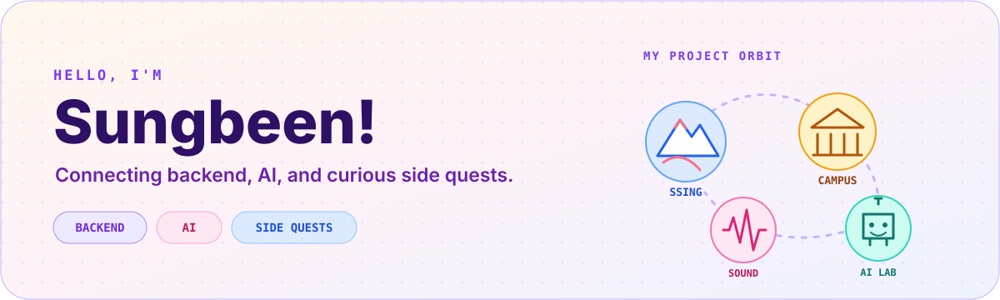
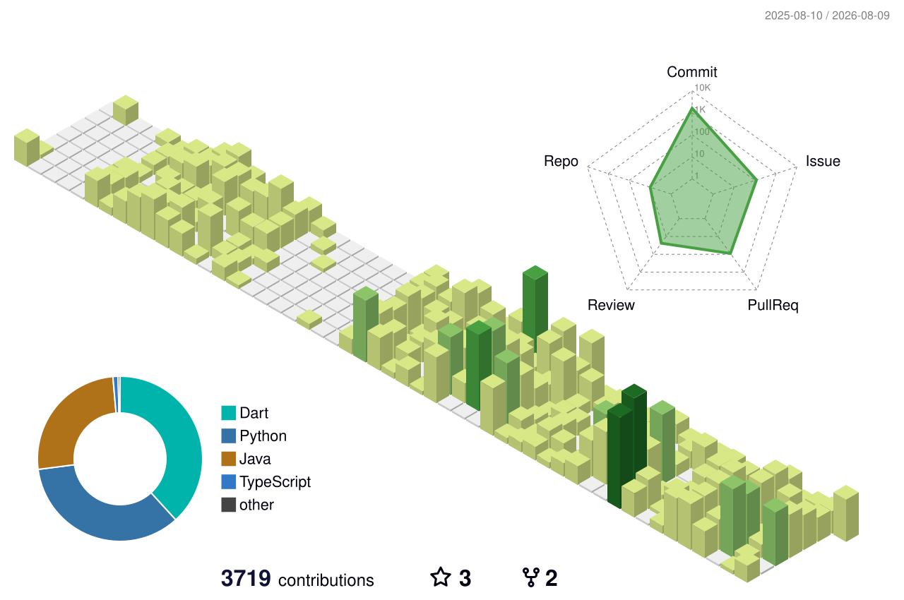

<picture>
  <source media="(prefers-color-scheme: dark)" srcset="./assets/banner-dark.svg">
  <source media="(prefers-color-scheme: light)" srcset="./assets/banner-light.svg">
  
</picture>

<div align="center">

### 안녕하세요, 노성빈입니다 👋

**Backend & AI Systems Builder**  
복잡한 운영 문제를 신뢰할 수 있는 백엔드, 검증 가능한 AI 워크플로, 실제로 쓰이는 제품으로 만듭니다.

[](https://github.com/SungKong00)

</div>

## Featured public work

<table>
  <tr>
    <td width="33%" valign="top">
      <h3>⛷️ SSING Server</h3>
      <p>스키 강습생과 강사를 조건 기반으로 연결하고, 제안·수락·강습 흐름을 안전하게 관리하는 서비스입니다.</p>
      <p><strong>Role</strong><br>Server Developer · Lead</p>
      <p><code>Java 21</code> <code>Spring Boot</code> <code>MySQL</code> <code>WebSocket</code> <code>AWS</code></p>
      <p><a href="https://github.com/TEAM-SSING/SSING-SERVER"><strong>Explore repository →</strong></a></p>
    </td>
    <td width="33%" valign="top">
      <h3>🏛️ University Workspace</h3>
      <p>학과·동아리·학회를 위해 흩어진 소통, 권한, 일정과 공간 예약을 하나의 워크스페이스로 통합한 1인 풀스택 프로젝트입니다.</p>
      <p><strong>Evidence</strong><br>2-layer permissions · 455+ tests</p>
      <p><code>Kotlin</code> <code>Spring Boot</code> <code>Flutter</code> <code>PostgreSQL</code></p>
      <p><a href="https://github.com/SungKong00/univ_group_management"><strong>Explore repository →</strong></a></p>
    </td>
    <td width="33%" valign="top">
      <h3>🎛️ Harness Maestro</h3>
      <p>AI 에이전트가 필요한 근거와 검토 관점만 선택해 구현·검증하도록 돕는 프로젝트 하네스입니다.</p>
      <p><strong>Focus</strong><br>Routing · contracts · evidence-based verification</p>
      <p><code>Python</code> <code>CLI</code> <code>Agent workflows</code> <code>Evaluation</code></p>
      <p><a href="https://github.com/SungKong00/harness-maestro"><strong>Explore repository →</strong></a></p>
    </td>
  </tr>
</table>

<details>
<summary><strong>Selected private work — 2 substantial projects</strong></summary>

> The repositories remain private. Public-safe problem, role, decisions, and outcome summaries are being prepared without exposing confidential code or data.

### Confidential Project A

- **Problem:** Public-safe problem statement to be added
- **My role:** Scope and ownership to be added
- **Key decision:** One meaningful technical trade-off to be added
- **Outcome:** A measurable or observable result to be added
- **Stack:** Public-safe technologies to be added

### Confidential Project B

- **Problem:** Public-safe problem statement to be added
- **My role:** Scope and ownership to be added
- **Key decision:** One meaningful technical trade-off to be added
- **Outcome:** A measurable or observable result to be added
- **Stack:** Public-safe technologies to be added

<!--
Editing note:
For each private project, replace the five lines above with facts that are safe to publish.
Do not add customer names, production URLs, secrets, private screenshots, internal architecture,
or metrics that you are not authorized to disclose.
-->

</details>

## Toolbox

<div align="center">

**Backend · AI systems · Product delivery**


</div>

## How I work

```text
Understand the real constraint
  → design the smallest reliable system
  → make decisions explicit
  → verify with tests and observable evidence
  → ship, learn, and refine
```

<details>
<summary><code>GET /api/about</code></summary>

```json
{
  "role": "Backend & AI Systems Builder",
  "focus": [
    "reliable backend workflows",
    "measurable AI systems",
    "product-minded engineering"
  ],
  "currently_building": "harness-maestro"
}
```

</details>

## GitHub activity

<div align="center">

<picture>
  <source media="(prefers-color-scheme: dark)" srcset="./assets/generated/github-stats-dark.svg">
  <source media="(prefers-color-scheme: light)" srcset="./assets/generated/github-stats-light.svg">
  
</picture>

</div>

<details>
<summary><strong>3D contribution garden</strong></summary>

<picture>
  <source media="(prefers-color-scheme: dark)" srcset="./profile-3d-contrib/profile-night-green.svg">
  <source media="(prefers-color-scheme: light)" srcset="./profile-3d-contrib/profile-green.svg">
  
</picture>

</details>

<p align="center"><sub>Activity is context, not a measure of engineering quality. The project evidence above matters more.</sub></p>
