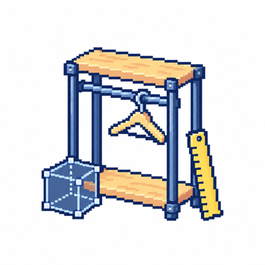

  

## 안녕하세요, 노성빈입니다 👋

백엔드 공부하면서 Claude와 Codex로 이것저것 만드는 대학생입니다. 팀에서 서버를 맡기도 하고, 혼자 웹 서비스와 인터랙티브 아트를 만들기도 합니다.

[Projects](#featured-projects) · [Experiments](#experiments) · [Experience & Awards](#experience--awards) · [Activity](#github-activity)

## Featured Projects

### [SSING](https://github.com/TEAM-SSING/SSING-SERVER)

2026.06–07 · Let's SOPT 앱잼 · 서버 리드 · Java / Spring Boot

스키 강습생과 강사를 연결하는 매칭 서비스. 인증과 매칭 API를 개발했습니다. 앱을 다시 켰을 때 서버의 현재 상태를 조회해 진행 중인 매칭을 복구하도록 했습니다.

[재접속 복구와 중복 매칭 방지](https://github.com/TEAM-SSING/SSING-SERVER/pull/139) · [참여한 PR](https://github.com/TEAM-SSING/SSING-SERVER/pulls?q=is%3Apr+is%3Amerged+author%3ASungKong00)

 

### [성균관대학교 영상학과 장비실 대여 시스템](./projects/README.md#장비실-대여-시스템)

2026.01–04 개발 · 1인 외주 개발·운영 · 현재 서비스 중 · 코드 비공개

학생의 장비·시설 신청부터 관리자 승인, 수령과 반납까지 관리하는 웹 서비스. 중복 신청 조정과 부분 반납·양도 등 실제 장비실 운영에 필요한 기능을 만들었습니다.

 

### [명륜 시네마](./projects/README.md#명륜-시네마)

2026.07– · 성균관대학교 · 1인 개발 중 · 코드 비공개

독립 영화를 찾아보고 감상하는 스트리밍 플랫폼. 기획전과 영화 탐색, 재생, 기기 내 이어보기를 갖춘 프리뷰를 개발하고 있습니다.

 

<picture>
  <source media="(prefers-color-scheme: dark)" srcset="./assets/retro-v2/daehospace-dark.png">
  
</picture>

### [대호공간 · 홈페이지 & 3D 견적기](./projects/README.md#대호공간)

2026.07– · 1인 개발 중 · 코드 비공개

시스템 행거 맞춤 제작업체의 홈페이지와 3D 견적 계산기. 현재는 가구의 부품과 배치를 검토하는 화면을 구현 중이며, 홈페이지와 실제 가격 산출 기능을 추가할 예정입니다.

 

<picture>
  <source media="(prefers-color-scheme: dark)" srcset="./assets/retro-v2/1km-dark.png">
  
</picture>

### [1KM](./projects/README.md#1km)

체험형 인터랙티브 아트 · TypeScript / React / Python · 코드 비공개

릴스 형식의 영상을 탐색하고, 열어 본 영상 수가 종이의 길이로 출력되는 작업. 관람 화면과 출력 프로그램을 연결하고, 출력 중 연결이 끊기는 경우를 다뤘습니다.

 

#### Other Exhibitions

- **[비밀의 못](https://github.com/SungKong00/the-secret-pond-sound-system)** · `2026.05` · 성균관대학교 녹음한 목소리를 쌓아 함께 재생하는 인터랙티브 아트. AI를 활용해 음향 소프트웨어를 혼자 개발했고, 실제 전시에 사용했습니다.
- **YEON** · `2026.02–03` · 성균관대학교 인터랙티브 전시의 소프트웨어·하드웨어 제작 및 개발에 참여했습니다.

## Experiments

AI에게 작업을 맡길 때 이전 결정과 코드 맥락을 어떻게 전달하고, 결과를 어떻게 확인할지 실험했습니다.

- **[Harness Maestro](https://github.com/SungKong00/harness-maestro)** — 작업 문맥과 검증, 완료 기록을 별도 도구로 관리하는 방식.
- **[Ariadne Forge](https://github.com/SungKong00/ariadne-forge)** — 별도 런타임 없이 Skill과 프로젝트 문서로 작업을 구성하는 방식.

두 프로젝트 모두 완성에 이르지는 못했지만, 접근을 바꿔 가며 연구하고 다듬은 기록을 남겼습니다. [Maestro 검증 코드](https://github.com/SungKong00/harness-maestro/blob/main/src/maestro/verification.py) · [Ariadne 설계 문서](https://github.com/SungKong00/ariadne-forge/blob/main/docs/project.md)

[대학 그룹 관리](https://github.com/SungKong00/univ_group_management)는 처음 만든 프로젝트입니다. 그룹과 채널을 관리하는 서버와 앱을 혼자 개발했고, 2025년 한신대학교 AI/SW 페스티벌에 참가했습니다.

## Experience & Awards

| 기간 | 활동 |
| --- | --- |
| 2026.04–07 | **Let's SOPT · 서버 YB** 2026.05 솝커톤 **P!NGO**(위치 기반 잼컨 수집) · 합동 세미나 **Korail Talk** — 서버 리드 |
| 2026.01 | **우수상 · 한신대학교 AI·Big Data·Contents 해커톤** Run-Twin — 디지털 휴먼 트윈 기반 러닝 훈련 AI 코칭 서비스, 1인 개발 |
| 2025.07–10 | **동상 · 한국 디지털 콘텐츠 학회 대학생논문경진대회** 대학 조직 맞춤형 협업 플랫폼 설계 및 구현, 1인 개발 |
| 2024.02–09 | **패스트캠퍼스 백엔드 개발 부트캠프 8기 수료** 야놀자 클론 프로젝트에서 PM·디자인·웹·백엔드 직군과 협업 |

## Tech Stack

<picture>
  <source media="(prefers-color-scheme: dark)" srcset="https://skillicons.dev/icons?i=java%2Cspring%2Cts%2Creact%2Cpostgres%2Cmysql&amp;theme=dark">
  <source media="(prefers-color-scheme: light)" srcset="https://skillicons.dev/icons?i=java%2Cspring%2Cts%2Creact%2Cpostgres%2Cmysql&amp;theme=light">
  
</picture>

## GitHub Activity

<picture>
  <source media="(prefers-color-scheme: dark)" srcset="./profile-3d-contrib/profile-night-rainbow.svg">
  <source media="(prefers-color-scheme: light)" srcset="./profile-3d-contrib/profile-green-animate.svg">
  
</picture>
