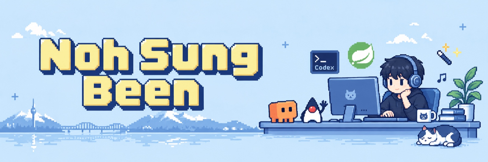
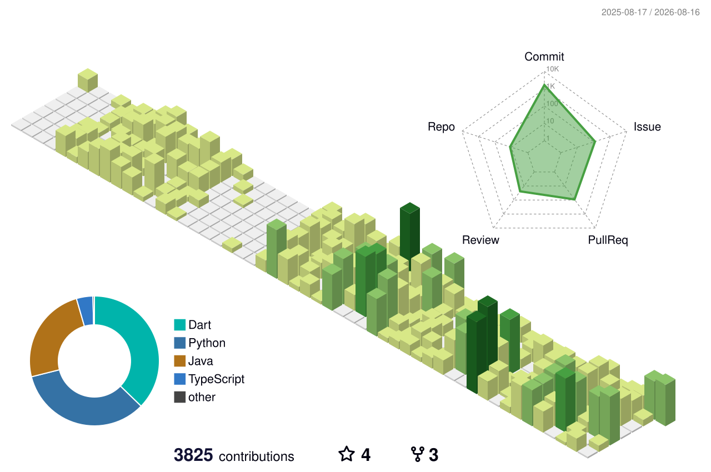

### 안녕하세요, 노성빈입니다 👋

백엔드 공부하면서 Claude와 Codex로 이것저것 만들고 있습니다.

## Featured Projects

스키 강습생과 강사를 연결하는 매칭 서비스.

팀에서 서버 개발을 맡아 인증·매칭 API와 앱 재접속 시 진행 상태 복구를 구현했습니다.

`Java` `Spring Boot` `MySQL` `WebSocket`

[저장소](https://github.com/TEAM-SSING/SSING-SERVER) · [매칭 복구 작업](https://github.com/TEAM-SSING/SSING-SERVER/pull/139) · [참여한 PR](https://github.com/TEAM-SSING/SSING-SERVER/pulls?q=is%3Apr+is%3Amerged+author%3ASungKong00)

<table>
  <tr>
    <td width="50%" valign="top">
      
      <h3>장비 대여 시스템</h3>
      
성균관대 영상학과의 장비·시설 대여 관리 시스템.

      
학생의 신청부터 관리자 승인·수령·반납까지 처리하며, 중복 신청 조정과 부분 반납·양도를 다룹니다.

      
<code>TypeScript</code> <code>React</code> <code>PostgreSQL</code>

      
코드 비공개

    </td>
    <td width="50%" valign="top">
      
      <h3>FILM-SKKU</h3>
      
학교 구성원이 독립·고전 영화를 찾아보고 감상하는 모바일 시네마테크.

      
기획전·영화 탐색·재생·기기 내 이어보기를 갖춘 프리뷰를 개발 중입니다.

      
<code>TypeScript</code> <code>React</code> <code>Hono</code> <code>Mux</code>

      
개발 중 · 코드 비공개

    </td>
  </tr>
  <tr>
    <td width="50%" valign="top">
      
      <h3>1KM</h3>
      
릴스 형식의 영상을 탐색하고, 열어 본 영상 수가 종이의 길이로 출력되는 체험형 인터랙티브 아트.

      
관람 화면과 출력 프로그램을 연결하고, 출력 중 연결이 끊기는 경우를 다뤘습니다.

      
<code>TypeScript</code> <code>React</code> <code>Python</code>

      
코드 비공개

    </td>
    <td width="50%" valign="top">
      
      <h3>가구 회사 홈페이지 · 3D 견적기</h3>
      
가구 판매 회사의 홈페이지와 3D 견적기를 함께 만드는 프로젝트.

      
현재는 특정 모델의 부품·배치를 검토하는 화면을 구현하고 있습니다. 회사 홈페이지와 실제 가격 산출 기능은 추가할 예정입니다.

      
<code>TypeScript</code> <code>Astro</code> <code>React</code>

      
개발 중 · 홈페이지 제작 예정 · 코드 비공개

    </td>
  </tr>
</table>

## Side Projects

| 프로젝트 | 구분 | 내용 |
| --- | --- | --- |
| [비밀의 못](https://github.com/SungKong00/the-secret-pond-sound-system) | AI 활용 · 전시 완료 | 녹음한 목소리를 쌓아 함께 재생하는 인터랙티브 아트 |
| [대학 그룹 관리](https://github.com/SungKong00/univ_group_management) | 첫 프로젝트 | 그룹과 채널을 관리하는 서버와 모바일 앱 |
| [Harness Maestro](https://github.com/SungKong00/harness-maestro) | 연구·실험 | 에이전트의 작업 문맥·검증 명령·완료 기록을 별도 도구에서 다루는 방식 |
| [Ariadne Forge](https://github.com/SungKong00/ariadne-forge) | 연구·실험 | 별도 런타임 없이 Skill과 프로젝트 문서로 개발 작업을 구성하는 방식 |

하네스 두 프로젝트는 완성에는 이르지 못했지만, 설계와 실험 기록을 남겨 둔 작업입니다.

[Maestro 검증 처리](https://github.com/SungKong00/harness-maestro/blob/main/src/maestro/verification.py) · [Ariadne 설계 문서](https://github.com/SungKong00/ariadne-forge/blob/main/docs/project.md)

## Tech Stack

<picture>
  <source media="(prefers-color-scheme: dark)" srcset="https://skillicons.dev/icons?i=java%2Cspring%2Cts%2Creact%2Cpostgres%2Cmysql&amp;theme=dark">
  <source media="(prefers-color-scheme: light)" srcset="https://skillicons.dev/icons?i=java%2Cspring%2Cts%2Creact%2Cpostgres%2Cmysql&amp;theme=light">
  
</picture>

Java · Spring Boot · TypeScript · React · PostgreSQL · MySQL

## GitHub Activity

<picture>
  <source media="(prefers-color-scheme: dark)" srcset="./profile-3d-contrib/profile-night-rainbow.svg">
  <source media="(prefers-color-scheme: light)" srcset="./profile-3d-contrib/profile-green-animate.svg">
  
</picture>
